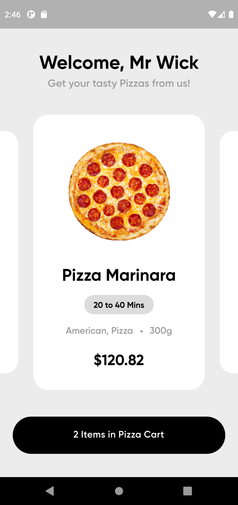

# Parallel 37 - Food Ordering Application (Mock)

Parallel 37 is a mock food ordering application for ordering Pizzas. It was built using Dart and Flutter with with sole focus on handling states using RiverPod and StateNotifier hence the core feature which enables users to add Pizzas to cart. This project fetches data from a manually written array of models but it's using <a href="https://pub.dev/packages/sqflite">SQFLite (SQLite Plugin for Flutter)</a> under the hood to store items added to the cart locally on your device, that way you can still have access to items in your cart even after closing the app (unless you choose to remove it).

## :camera: Preview

<p>Visit <b><a href="https://player.vimeo.com/video/749574365?h=de39e4ece7">this link</a></b> to see the application in action</p>
<div style="display: flex;">
    
    
    
    
</div>

## :clipboard: Requirements

- Operating System (Windows, Linux or MacOS)
- Flutter must be installed on the Operating System
- Knowledge of the Flutter Framework
- IDE (Visual Studio Code, Android Studio e.t.c)
- Mobile Emulator or Mobile Device
- Hands to code :smile:

## :pushpin: Dependencies

- flutter_svg: ^1.1.5
- path_provider: ^2.0.10
- sqflite: ^2.0.2+1
- flutter_riverpod: ^1.0.4

## :rocket: Getting Started

NOTE: You must have Flutter installed to run this project. You can learn about the installation <a href="https://www.google.com/url?sa=t&rct=j&q=&esrc=s&source=web&cd=&cad=rja&uact=8&ved=2ahUKEwj2sp_h9e_5AhUSP-wKHQrvCx4QFnoECAkQAQ&url=https%3A%2F%2Fdocs.flutter.dev%2Fget-started%2Finstall&usg=AOvVaw0_DysGRxe6bHMb0c8Whvun">here</a>.

#### 1. Clone the repository

```sh
$ git clone https://github.com/devwraithe/parallel_37
```

#### 2. Move to the project directory

```
$ cd parallel_37
```

#### 3. Install the required dependencies

```sh
$ flutter pub get
```

#### 4. Run the application (on a mobile device)

```sh
$ flutter run
```

## :heart: Think it's great?

If you love this project and you find it useful, please consider giving it a :star: and share it with everyone you know :heart_eyes:.

## :question: Need Help?

- For support, you can get in touch with me via <a href="https://www.linkedin.com/in/ibrahimaibrahim">LinkedIn</a>
