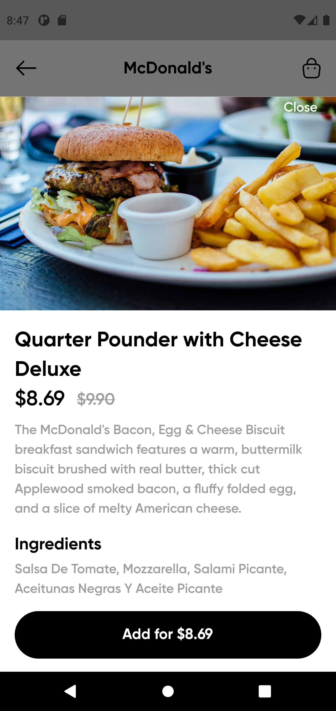

# Parallel 37 - Food Ordering Application (Mock)

Parallel 37 is an application for ordering foods from different restaureants. Based on the design, each restaurant has a list of menu that the user can order from and an order can't be added to the cart twice (more updates coming). It was built using Dart and Flutter with with focus on handling states using RiverPod, this project is an improvement to the previous version which allows users to add just 3 kinds of pizzas. This project fetches data from local JSON files and uses <a href="https://pub.dev/packages/sqflite">SQFLite (SQLite Plugin for Flutter)</a> to store products added to the cart locally on your device, that way you can still have access to items in your cart even after closing the app (unless you choose to remove the item).

## :camera: Preview

<div style="display: flex;">
    
    
    
    
    
    
</div>

## :clipboard: Requirements

- Operating System (Windows, Linux or MacOS)
- Flutter must be installed on the Operating System
- Knowledge of the Flutter Framework
- IDE (Visual Studio Code, Android Studio e.t.c)
- Mobile Emulator or Mobile Device
- Hands to code :smile:

## :pushpin: Dependencies

- flutter_svg: ^1.1.5 (Load SVG Files)
- path_provider: ^2.0.10 (Find common locations on the filesystem)
- sqflite: ^2.0.2+1 (SQLite plugin for Flutter)
- flutter_riverpod: ^1.0.4 (Managing states)
- equatable: ^2.0.5 (Easily compare instances of the same objects)
- dartz: ^0.10.1 (Handling errors)
- http: ^0.13.5 (Making network requests)
- cached_network_image: ^3.2.2 (Keep loaded image in cache)

## :rocket: Getting Started

NOTE: You must have Flutter installed to run this project. You can learn about the installation <a href="https://www.google.com/url?sa=t&rct=j&q=&esrc=s&source=web&cd=&cad=rja&uact=8&ved=2ahUKEwj2sp_h9e_5AhUSP-wKHQrvCx4QFnoECAkQAQ&url=https%3A%2F%2Fdocs.flutter.dev%2Fget-started%2Finstall&usg=AOvVaw0_DysGRxe6bHMb0c8Whvun">here</a>.

#### 1. Clone the repository

```sh
$ git clone https://github.com/devwraithe/parallel_37
```

#### 2. Move to the project directory

```
$ cd parallel_37
```

#### 3. Install the required dependencies

```sh
$ flutter pub get
```

#### 4. Run the application (on a mobile device)

```sh
$ flutter run
```

## :heart: Think it's great?

If you love this project and you find it useful, please consider giving it a :star: and share it with everyone you know :heart_eyes:.

## :question: Need Help?

- For support, you can get in touch with me via <a href="https://www.linkedin.com/in/ibrahimaibrahim">LinkedIn</a>
